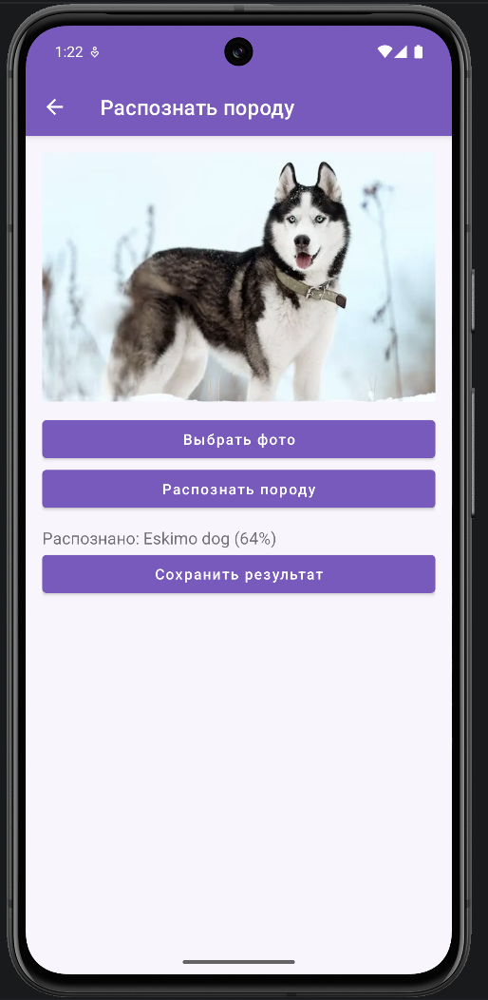

# Отчет по выполнению практической работы №2

### Автор: Фёдоров Антон Сергеевич
### Группа: БСБО-09-23

---

## Цель работы

Целью данной работы являлось развитие чистой архитектуры: введение раздельных моделей данных на слоях domain и data, выделение хранилища (`MovieStorage`) из репозитория, сборка модульного Gradle-проекта (`app` / `data` / `domain`), а также доработка собственного приложения: прототип экранов, Firebase Auth, три способа работы с данными (SharedPreferences, Room, NetworkApi с моками).

---

## Структура проекта

Работа выполнена в каталоге `Lesson10`:

-   **`MovieProject`**: учебный каркас. Пакет `ru.mirea.fedorov.lesson9`. Модули `app`, `data`, `domain`. Отдельная storage-модель фильма, маппинг в репозитории, SharedPreferences.
-   **`DogGuide`**: контрольное приложение. Пакет `ru.mirea.fedorov.dogguide`. Те же три модуля. Firebase Auth, SharedPreferences клиента, Room (избранное), `NetworkApi` + мок JSON, TensorFlow Lite.
-   **`design/prototype.html`**: прототип экранов (аналог Figma).

Зависимости модулей:

```
app  →  domain
app  →  data
data →  domain
```

`domain` — Java Library, без Android. `data` — Android Library (Context, prefs, Room, сеть, Firebase). `app` — UI и сборка зависимостей.

---

## Выполненные задания

### Задание 1. Раздельные модели и хранилище (проект `MovieProject`)

**Задача:** Открыть приложение из практики №1 и доработать по аналогии с методичкой. Репозиторий не должен сам писать в SharedPreferences. Нужны интерфейс `MovieStorage` в слое data, реализация `SharedPrefMovieStorage`, своя модель storage (`id`, `name`, `localDate`) и маппинг domain ↔ storage.

**Код для `domain.models.Movie`:**

```java
package ru.mirea.fedorov.lesson9.domain.models;

public class Movie {
    private int id;
    private String name;

    public Movie(int id, String name) {
        this.id = id;
        this.name = name;
    }

    public int getId() {
        return id;
    }

    public String getName() {
        return name;
    }
}
```

**Код для `data.storage.models.Movie` (отдельная модель, domain сюда не импортируется):**

```java
package ru.mirea.fedorov.lesson9.data.storage.models;

public class Movie {
    private int id;
    private String name;
    private String localDate;

    public Movie(int id, String name, String localDate) {
        this.id = id;
        this.name = name;
        this.localDate = localDate;
    }

    public String getName() {
        return name;
    }

    public int getId() {
        return id;
    }

    public String getLocalDate() {
        return localDate;
    }
}
```

**Код для `MovieStorage.java`:**

```java
package ru.mirea.fedorov.lesson9.data.storage;

import ru.mirea.fedorov.lesson9.data.storage.models.Movie;

public interface MovieStorage {
    Movie get();

    boolean save(Movie movie);
}
```

**Код для `SharedPrefMovieStorage.java`:**

```java
package ru.mirea.fedorov.lesson9.data.storage.sharedprefs;

public class SharedPrefMovieStorage implements MovieStorage {
    private static final String SHARED_PREFS_NAME = "shared_prefs_name";
    private static final String KEY = "movie_name";
    private static final String DATE_KEY = "movie_date";
    private static final String ID_KEY = "movie_id";

    private final SharedPreferences sharedPreferences;

    public SharedPrefMovieStorage(Context context) {
        sharedPreferences = context.getSharedPreferences(SHARED_PREFS_NAME, Context.MODE_PRIVATE);
    }

    @Override
    public Movie get() {
        String movieName = sharedPreferences.getString(KEY, "unknown");
        String movieDate = sharedPreferences.getString(DATE_KEY, String.valueOf(LocalDate.now()));
        int movieId = sharedPreferences.getInt(ID_KEY, -1);
        return new Movie(movieId, movieName, movieDate);
    }

    @Override
    public boolean save(Movie movie) {
        SharedPreferences.Editor editor = sharedPreferences.edit();
        editor.putString(KEY, movie.getName());
        editor.putString(DATE_KEY, movie.getLocalDate());
        editor.putInt(ID_KEY, movie.getId());
        editor.commit();
        return true;
    }
}
```

В storage нет бизнес-условий — только чтение и запись.

**Код для `MovieRepositoryImpl.java` (роутер + маппинг):**

```java
public class MovieRepositoryImpl implements MovieRepository {
    private final MovieStorage movieStorage;

    public MovieRepositoryImpl(MovieStorage movieStorage) {
        this.movieStorage = movieStorage;
    }

    @Override
    public boolean saveMovie(ru.mirea.fedorov.lesson9.domain.models.Movie movie) {
        movieStorage.save(mapToStorage(movie));
        return true;
    }

    @Override
    public ru.mirea.fedorov.lesson9.domain.models.Movie getMovie() {
        Movie movie = movieStorage.get();
        return mapToDomain(movie);
    }

    private Movie mapToStorage(ru.mirea.fedorov.lesson9.domain.models.Movie movie) {
        return new Movie(movie.getId(), movie.getName(), LocalDate.now().toString());
    }

    private ru.mirea.fedorov.lesson9.domain.models.Movie mapToDomain(Movie movie) {
        return new ru.mirea.fedorov.lesson9.domain.models.Movie(movie.getId(), movie.getName());
    }
}
```

**Сборка в `MainActivity`:**

```java
MovieStorage movieStorage = new SharedPrefMovieStorage(this);
MovieRepository movieRepository = new MovieRepositoryImpl(movieStorage);
```

---

### Задание 2. Раздельные Gradle-модули (`MovieProject` и `DogGuide`)

**Задача:** Вынести `data` в Android Library, `domain` в Java/Kotlin Library, UI оставить в `app`. Прописать модули в `settings.gradle`.

**Код для `MovieProject/settings.gradle`:**

```gradle
rootProject.name = "MovieProject"
include ':app'
include ':data'
include ':domain'
```

**Код для `DogGuide/settings.gradle`:**

```gradle
rootProject.name = "DogGuide"
include ':app'
include ':data'
include ':domain'
```

`domain/build.gradle` — плагин `java-library`.  
`data/build.gradle` — плагин `com.android.library`, зависимость `implementation project(':domain')`.  
`app/build.gradle` — `implementation project(':domain')` и `implementation project(':data')`.

---

### Задание 3. Прототип экранов

**Задача:** Нарисовать прототип в Figma или аналогичном сервисе.

Прототип экранов DogGuide (список пород, вход, карточка, распознавание): [`design/prototype.html`](design/prototype.html).

---

### Задание 4. Firebase Auth на трёх модулях (`DogGuide`)

**Задача:** Новая Activity авторизации с Firebase Auth. Логику FB распределить между `app`, `domain` и `data`.

| Модуль | Роль |
|--------|------|
| `domain` | `UserRepository`, `LoginUserUseCase`, `RegisterUserUseCase`, `AuthOutcome` |
| `data` | `FirebaseAuthDataSource`, `UserRepositoryImpl`, `ClientStorage` |
| `app` | `LoginActivity`, сборка в `DogGuideApp` |

**Код для `FirebaseAuthDataSource.java`:**

```java
public class FirebaseAuthDataSource {
    private final FirebaseAuth firebaseAuth;

    public FirebaseAuthDataSource() {
        this.firebaseAuth = FirebaseAuth.getInstance();
    }

    public FirebaseUser login(String email, String password) throws Exception {
        AuthResult result = Tasks.await(
                firebaseAuth.signInWithEmailAndPassword(email, password),
                15,
                TimeUnit.SECONDS
        );
        return result.getUser();
    }

    public FirebaseUser register(String email, String password) throws Exception {
        AuthResult result = Tasks.await(
                firebaseAuth.createUserWithEmailAndPassword(email, password),
                15,
                TimeUnit.SECONDS
        );
        return result.getUser();
    }

    public void logout() {
        firebaseAuth.signOut();
    }
}
```

Регистрация создаёт пользователя в Firebase. Вход возможен только с верным паролем. Логин без `@` преобразуется в email `логин@dogguide.app`. Пароль не короче 6 символов.

---

### Задание 5. Три способа обработки данных в репозиториях (`DogGuide`)

**Задача:** SharedPreferences — информация о клиенте; Room; класс `NetworkApi` для сети с замоканными данными.

#### 5.1. SharedPreferences — клиент

**Код для `ClientStorage.java`:**

```java
public class ClientStorage {
    private static final String PREFS_NAME = "client_prefs";
    private static final String KEY_LOGIN = "client_login";

    private final SharedPreferences prefs;

    public ClientStorage(Context context) {
        this.prefs = context.getApplicationContext()
                .getSharedPreferences(PREFS_NAME, Context.MODE_PRIVATE);
    }

    public void saveLogin(String login) {
        prefs.edit().putString(KEY_LOGIN, login).apply();
    }

    public String getLogin() {
        return prefs.getString(KEY_LOGIN, "");
    }

    public void clear() {
        prefs.edit().remove(KEY_LOGIN).apply();
    }
}
```

#### 5.2. Room — избранное

Избранные породы по-прежнему в Room, ключ — логин владельца + id породы. Сборка репозитория скрыта в `DataModule`, чтобы `app` не зависел от классов Room напрямую.

#### 5.3. NetworkApi + мок

**Код для `NetworkApi.java`:**

```java
public interface NetworkApi {
    Map<String, List<String>> getAllBreeds() throws Exception;

    String getRandomImage(String breedPath) throws Exception;
}
```

Реализации: `DogCeoApi` (живой JSON Dog CEO) и `MockNetworkApi` (замоканный JSON). `BreedRepositoryImpl` сначала ходит в сеть, при ошибке — в мок.

**Код для `MockNetworkApi` (фрагмент):**

```java
public class MockNetworkApi implements NetworkApi {
    private static final String MOCK_BREEDS_JSON = "{"
            + "\"status\":\"success\","
            + "\"message\":{"
            + "\"husky\":[],"
            + "\"pug\":[],"
            + "\"beagle\":[],"
            + "\"retriever\":[\"golden\"],"
            + "\"labrador\":[]"
            + "}}";

    @Override
    public Map<String, List<String>> getAllBreeds() throws Exception {
        JSONObject root = new JSONObject(MOCK_BREEDS_JSON);
        // разбор message → Map<порода, подпороды>
        ...
    }
}
```

**Сборка в `DogGuideApp`:**

```java
userRepository = new UserRepositoryImpl(
        new FirebaseAuthDataSource(),
        new ClientStorage(this)
);
breedRepository = new BreedRepositoryImpl(new DogCeoApi());
favoriteRepository = DataModule.createFavoriteRepository(this);
recognitionRepository = new RecognitionRepositoryImpl(this);
```

---

## Скриншоты




---

## Выводы

В ходе выполнения работы были освоены следующие концепции:

-   Разделение моделей domain и data: storage-модель независима и содержит `localDate`.
-   Репозиторий как роутер между слоями, а не как место записи в SharedPreferences.
-   Интерфейс `MovieStorage` принадлежит слою data.
-   Gradle-модули `app`, `data`, `domain` и направление зависимостей.
-   Firebase Authentication: регистрация и вход, логика на трёх модулях.
-   Три источника данных: SharedPreferences (клиент), Room (избранное), NetworkApi + JSON-мок.
-   Прототипирование экранов до наращивания функционала.
