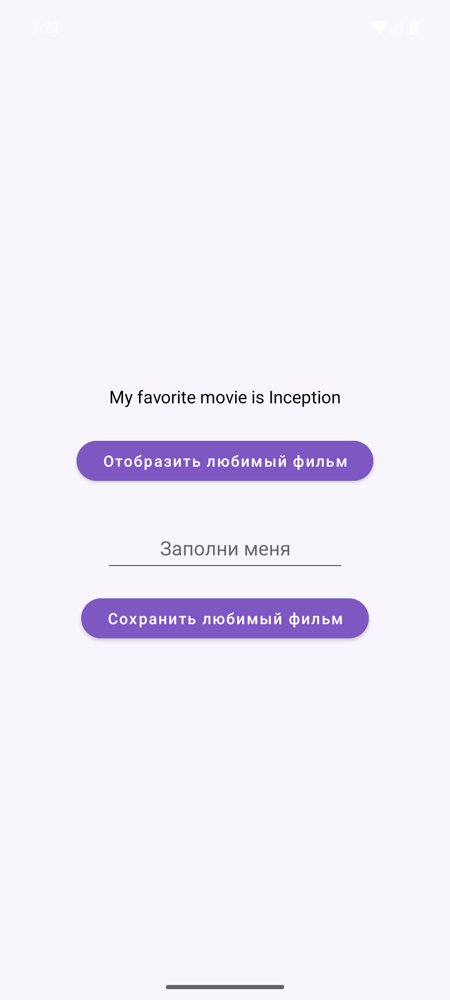
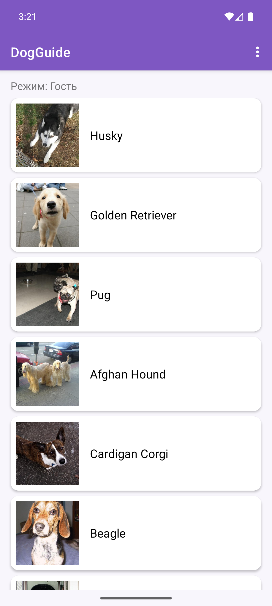
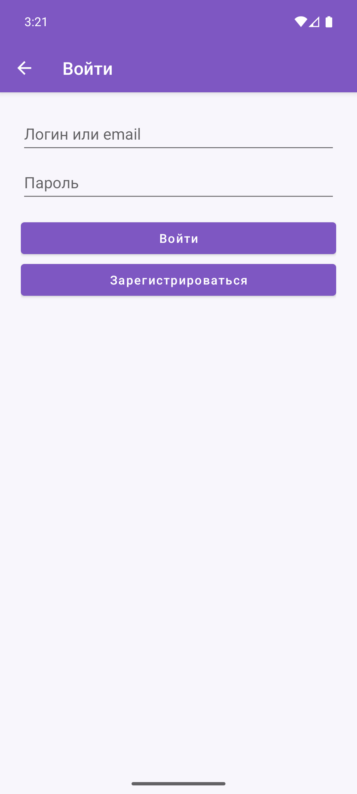

# Отчет по выполнению практической работы №3

### Автор: Фёдоров Антон Сергеевич
### Группа: БСБО-09-23

---

## Цель работы

Целью данной работы являлось освоение паттерна MVVM в слое `app`: вынести работу с use case из Activity во `ViewModel`, получать `ViewModel` через `ViewModelProvider` и фабрику, передавать состояние UI через `LiveData`. В контрольном приложении Activity обращается к domain только через ViewModel, а список пород собирается из сети и БД с помощью `MediatorLiveData`.

---

## Структура проекта

Работа выполнена в каталоге `Lesson11` (копия ПЗ2 с доработкой слоя app). `Lesson10` не изменялся.

-   **`MovieProject`**: учебный каркас. Пакет `ru.mirea.fedorov.lesson9`. Модули `app` / `data` / `domain`. `MainViewModel`, `ViewModelFactory`, `LiveData<String> favoriteMovie`.
-   **`DogGuide`**: контрольное приложение. Пакет `ru.mirea.fedorov.dogguide`. Те же три модуля. На каждый экран — свой ViewModel; каталог пород — `MediatorLiveData`.

В Android Studio открывать папку `Lesson11/MovieProject` или `Lesson11/DogGuide`.

---

## Выполненные задания

### Задание 1. ViewModel в слое app (проект `MovieProject`)

**Задача:** Открыть приложение из практики №1/№2 и изменить слой app по аналогии с методичкой. Activity больше не создаёт storage и не вызывает use case напрямую.

Добавлены зависимости `androidx.lifecycle:lifecycle-viewmodel:2.8.7` и `lifecycle-livedata:2.8.7`.

`MainViewModel` живёт в модуле **app**, принимает `MovieRepository` в конструкторе и не хранит View или Context Activity. Вызовы use case перенесены в `setText` / `getText`. Результат пишется в `MutableLiveData<String> favoriteMovie`, а не возвращается в Activity.

**Код для `MainViewModel.java`:**

```java
public class MainViewModel extends ViewModel {
    private final MovieRepository movieRepository;
    private final MutableLiveData<String> favoriteMovie = new MutableLiveData<>();

    public MainViewModel(MovieRepository movieRepository) {
        Log.d(MainViewModel.class.getSimpleName(), "MainViewModel created");
        this.movieRepository = movieRepository;
    }

    public MutableLiveData<String> getFavoriteMovie() {
        return favoriteMovie;
    }

    public void setText(Movie movie) {
        Boolean result = new SaveMovieToFavoriteUseCase(movieRepository).execute(movie);
        favoriteMovie.setValue(String.format("Save result %s", result));
    }

    public void getText() {
        Movie movie = new GetFavoriteFilmUseCase(movieRepository).execute();
        favoriteMovie.setValue(String.format("My favorite movie is %s", movie.getName()));
    }

    @Override
    protected void onCleared() {
        Log.d(MainViewModel.class.getSimpleName(), "MainViewModel cleared");
        super.onCleared();
    }
}
```

Создание через `new MainViewModel()` при повороте экрана даёт новый экземпляр: в logcat снова `MainViewModel created`, предыдущий вызывает `onCleared`. Через `ViewModelProvider` ViewModel переживает поворот, `onCleared` вызывается только при уничтожении Activity (выход из приложения).

Activity — `AppCompatActivity`. Правильное получение:

```java
vm = new ViewModelProvider(this, new ViewModelFactory(this)).get(MainViewModel.class);
```

---

### Задание 2. ViewModelFactory

**Задача:** Собрать storage и repository в фабрике. Context используется только там, не во ViewModel.

**Код для `ViewModelFactory.java`:**

```java
public class ViewModelFactory implements ViewModelProvider.Factory {
    private final Context context;

    public ViewModelFactory(Context context) {
        this.context = context.getApplicationContext();
    }

    @NonNull
    @Override
    @SuppressWarnings("unchecked")
    public <T extends ViewModel> T create(@NonNull Class<T> modelClass) {
        MovieStorage sharedPrefMovieStorage = new SharedPrefMovieStorage(context);
        MovieRepository movieRepository = new MovieRepositoryImpl(sharedPrefMovieStorage);
        return (T) new MainViewModel(movieRepository);
    }
}
```

---

### Задание 3. LiveData

**Задача:** `setText` / `getText` не возвращают значение. Activity подписывается на `favoriteMovie` и только вызывает методы ViewModel с кнопок. После поворота LiveData отдаёт последнее значение.

**Код для `MainActivity.java` (фрагмент):**

```java
vm.getFavoriteMovie().observe(this, new Observer<String>() {
    @Override
    public void onChanged(String s) {
        textView.setText(s);
    }
});

findViewById(R.id.buttonSaveMovie).setOnClickListener(new View.OnClickListener() {
    @Override
    public void onClick(View view) {
        vm.setText(new Movie(2, text.getText().toString()));
    }
});

findViewById(R.id.buttonGetMovie).setOnClickListener(new View.OnClickListener() {
    @Override
    public void onClick(View view) {
        vm.getText();
    }
});
```



---

### Задание 4. Контрольное приложение DogGuide

**Задача:** Семь пунктов функционала из ПЗ1 сохраняются. Activity общается с domain только через ViewModel. Состояние UI — LiveData. Изучить `MediatorLiveData`: объединить данные из замоканной сети и из БД.

Экраны больше не создают use case сами. Фабрика `DogGuideViewModelFactory` берёт репозитории из `DogGuideApp` и собирает ViewModel:

| Экран | ViewModel | LiveData |
|--------|-----------|----------|
| Список пород | `BreedListViewModel` | каталог, загрузка, сессия |
| Вход | `LoginViewModel` | исход auth, загрузка |
| Карточка | `BreedDetailsViewModel` | порода, избранное |
| Избранное | `FavoritesViewModel` | список избранного |
| Распознавание | `RecognizeViewModel` | результат, загрузка |

**Код для фабрики (фрагмент):**

```java
if (modelClass.isAssignableFrom(BreedListViewModel.class)) {
    return (T) new BreedListViewModel(
            app.getBreedRepository(),
            app.getFavoriteRepository(),
            app.getUserRepository()
    );
}
```

**Код для `MainActivity`:** кнопки и список только читают LiveData и зовут методы ViewModel.

```java
viewModel = new ViewModelProvider(this, new DogGuideViewModelFactory(getApplication()))
        .get(BreedListViewModel.class);

viewModel.getCatalog().observe(this, breeds -> adapter.submitList(breeds));
viewModel.getLoading().observe(this, loading ->
        progressBar.setVisibility(Boolean.TRUE.equals(loading) ? View.VISIBLE : View.GONE));
viewModel.getSession().observe(this, this::renderSession);
```

`MediatorLiveData` в `BreedListViewModel` сливает два источника: породы из сети (Dog CEO или `MockNetworkApi`) и избранное из Room. При изменении любого источника каталог пересобирается.

**Код для `BreedListViewModel` (слияние сети и БД):**

```java
private final MutableLiveData<List<Breed>> networkBreeds = new MutableLiveData<>();
private final MutableLiveData<List<Breed>> databaseBreeds = new MutableLiveData<>();
private final MediatorLiveData<List<Breed>> catalog = new MediatorLiveData<>();

public BreedListViewModel(...) {
    catalog.addSource(networkBreeds, value -> merge());
    catalog.addSource(databaseBreeds, value -> merge());
    load();
}

private void merge() {
    Map<String, Breed> merged = new LinkedHashMap<>();
    List<Breed> fromDatabase = databaseBreeds.getValue();
    List<Breed> fromNetwork = networkBreeds.getValue();
    if (fromDatabase != null) {
        for (Breed breed : fromDatabase) {
            merged.put(breed.getId(), breed);
        }
    }
    if (fromNetwork != null) {
        for (Breed breed : fromNetwork) {
            merged.put(breed.getId(), breed);
        }
    }
    catalog.setValue(new ArrayList<>(merged.values()));
}
```





---

## Выводы

В ходе выполнения работы были освоены следующие концепции:

-   MVVM: View не вызывает use case, только методы ViewModel и подписку на LiveData.
-   `ViewModelProvider` сохраняет ViewModel при повороте экрана; `new ViewModel()` — нет.
-   `ViewModelFactory` собирает storage и repository; Context не попадает во ViewModel.
-   `MutableLiveData` отдаёт последнее значение новому Observer после поворота.
-   `MediatorLiveData` объединяет поток из сети (или мока) и поток из Room без LiveData в слое domain.
-   В DogGuide каждый экран имеет свой ViewModel; функционал ПЗ1 сохранён.
