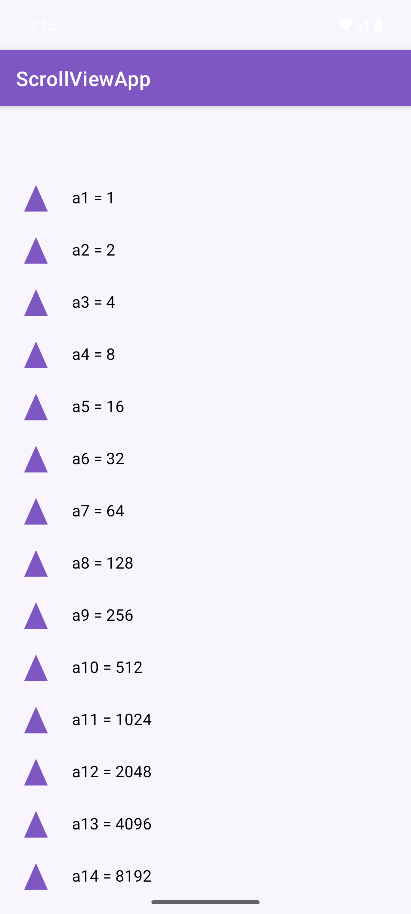
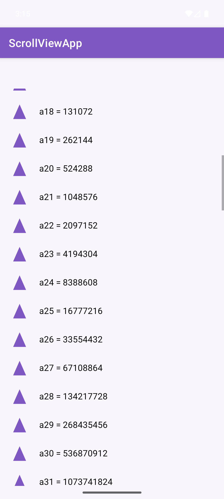
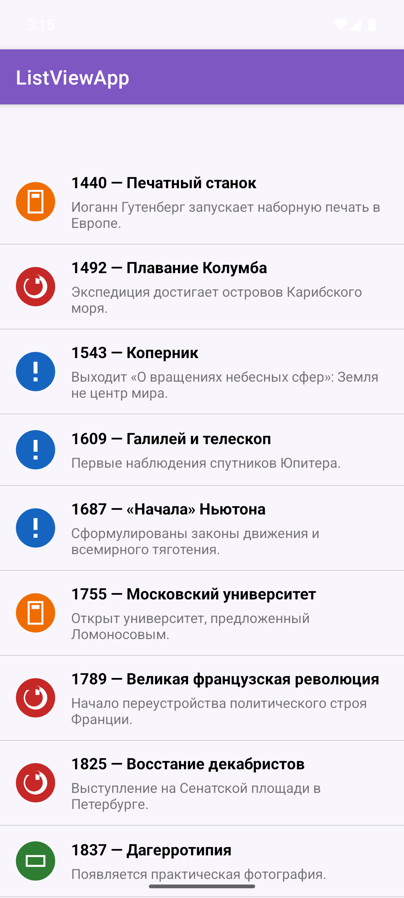
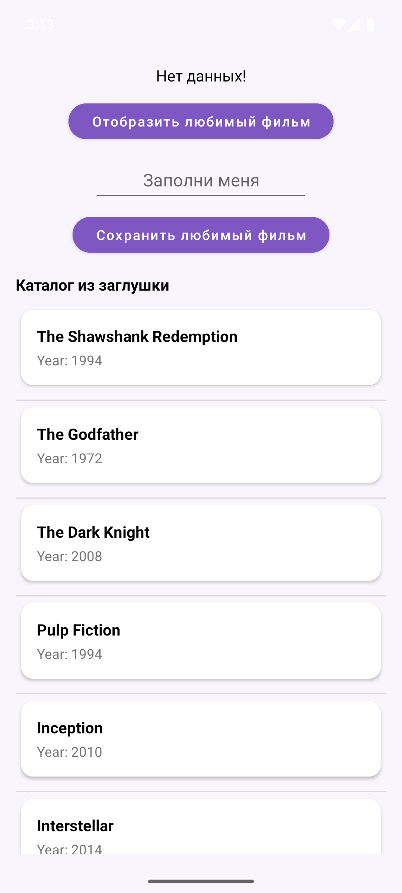
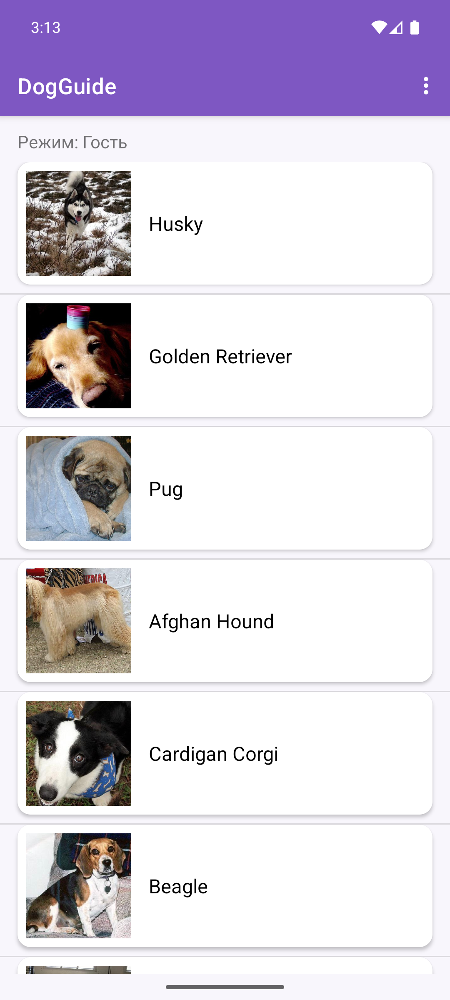
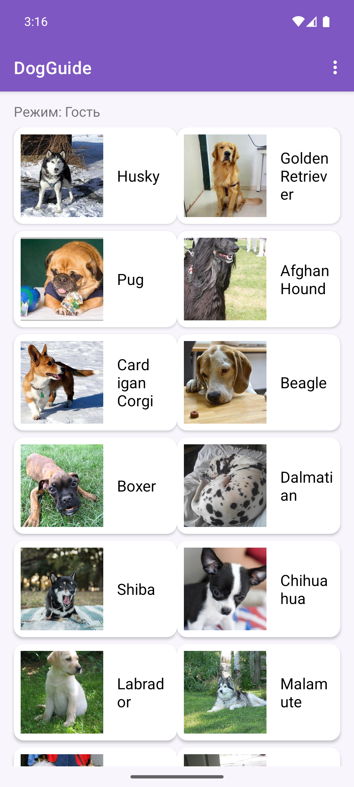
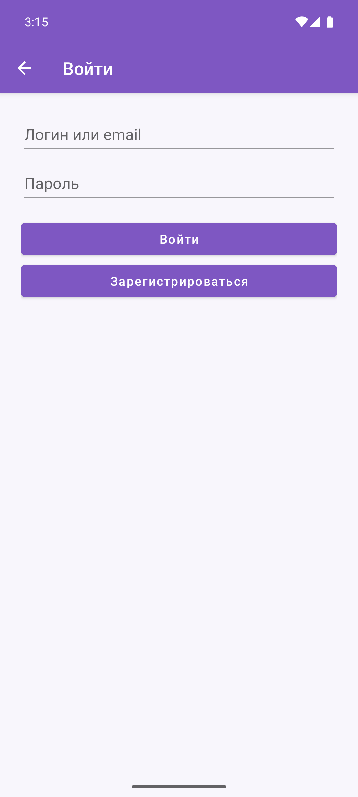

# Отчет по выполнению практической работы №4

### Автор: Фёдоров Антон Сергеевич
### Группа: БСБО-09-23

---

## Цель работы

Целью данной работы являлось изучение способов отображения списков в Android: `ScrollView` с `LayoutInflater`, `ListView` с адаптером и паттерном ViewHolder, `RecyclerView` с `LayoutManager`, а также передача набора данных из заглушки репозитория в слой представления через `LiveData`.

---

## Структура проекта

Работа выполнена в каталоге `Lesson12`. В Android Studio открывать **папку конкретного приложения**, не корень репозитория.

-   **`ScrollViewApp`**: учебный модуль. Пакет `ru.mirea.fedorov.scrollviewapp`. Геометрическая прогрессия со знаменателем 2, 100 элементов.
-   **`ListViewApp`**: учебный модуль. Пакет `ru.mirea.fedorov.listviewapp`. Исторические события и книги (более 30 пунктов) с изображением и описанием.
-   **`MovieProject`**: учебный каркас из ПЗ1–ПЗ3. Пакет `ru.mirea.fedorov.lesson9`. Заглушка каталога фильмов, `LiveData`, `RecyclerView`.
-   **`DogGuide`**: контрольное приложение. Пакет `ru.mirea.fedorov.dogguide`. Список пород через `RecyclerView` и `LiveData`, заглушка `MockNetworkApi`, переключение Linear / Grid / Staggered.

---

## Выполненные задания

### Задание 1. ScrollViewApp

**Задача:** Создать модуль `ScrollViewApp` (Empty Views Activity). Отобразить геометрическую прогрессию со знаменателем 2 до 100-го элемента. Приложить скрин экрана.

Разметка экрана содержит `ScrollView` с одним потомком — контейнером `LinearLayout` (`wrapper`). Элемент списка описан в `item.xml` (иконка + `TextView`).

В `MainActivity` элементы создаются через `LayoutInflater` и добавляются в контейнер. Знаменатель 2 даёт последовательность \(a_n = 2^{n-1}\). Для \(a_{100} = 2^{99}\) используется `BigInteger`.

**Код для `activity_main.xml` (фрагмент):**

```xml
<ScrollView
    android:id="@+id/scrollView"
    android:layout_width="0dp"
    android:layout_height="0dp"
    android:fillViewport="true"
    app:layout_constraintBottom_toBottomOf="parent"
    app:layout_constraintEnd_toEndOf="parent"
    app:layout_constraintStart_toStartOf="parent"
    app:layout_constraintTop_toTopOf="parent">

    <LinearLayout
        android:id="@+id/wrapper"
        android:layout_width="match_parent"
        android:layout_height="wrap_content"
        android:orientation="vertical"
        android:padding="8dp" />
</ScrollView>
```

**Код для `MainActivity.java`:**

```java
LinearLayout wrapper = findViewById(R.id.wrapper);
BigInteger value = BigInteger.ONE;
for (int i = 1; i <= ITEM_COUNT; i++) {
    View view = getLayoutInflater().inflate(R.layout.item, wrapper, false);
    TextView text = view.findViewById(R.id.textView);
    text.setText(String.format(Locale.US, "a%d = %s", i, value));
    wrapper.addView(view);
    value = value.multiply(BigInteger.valueOf(RATIO));
}
```





---

### Задание 2. ListViewApp

**Задача:** Создать модуль `ListViewApp`. Список авторов и книг на ближайшие 30 лет (более 30 пунктов) и список исторических событий с кратким описанием и изображением. Приложить скрин экрана.

Реализован один `ListView` на 36 пунктов: исторические события и книги. Каждый элемент — картинка, заголовок и описание. Адаптер `EventAdapter` наследует `ArrayAdapter` и держит `ViewHolder`, чтобы не вызывать `findViewById` на каждом `getView`.

**Код для `EventAdapter.java`:**

```java
public class EventAdapter extends ArrayAdapter<HistoricalEvent> {
    @NonNull
    @Override
    public View getView(int position, @Nullable View convertView, @NonNull ViewGroup parent) {
        ViewHolder holder;
        if (convertView == null) {
            convertView = LayoutInflater.from(getContext())
                    .inflate(R.layout.item_event, parent, false);
            holder = new ViewHolder();
            holder.imageView = convertView.findViewById(R.id.imageViewEvent);
            holder.titleView = convertView.findViewById(R.id.textViewTitle);
            holder.descriptionView = convertView.findViewById(R.id.textViewDescription);
            convertView.setTag(holder);
        } else {
            holder = (ViewHolder) convertView.getTag();
        }
        HistoricalEvent event = getItem(position);
        holder.imageView.setImageResource(event.getImageResId());
        holder.titleView.setText(event.getTitle());
        holder.descriptionView.setText(event.getDescription());
        return convertView;
    }
}
```



---

### Задание 3. RecyclerView + LiveData (проект `MovieProject`)

**Задача:** Открыть приложение из практики №1 и изменить по аналогии с примером стран БРИКС. В репозитории создать заглушку с набором данных (как для внешнего API). Передать данные в слой представления через `LiveData` и установить в `RecyclerView`.

Сохранена работа «любимый фильм» из ПЗ1–ПЗ3. Добавлен каталог из заглушки.

Заглушка `StubMovieCatalog` лежит в слое **data** и отдаёт 10 фильмов (id, название, год). Репозиторий маппит storage-модель в domain. Use case `GetMovieListUseCase` отдаёт список во ViewModel. `MainViewModel` кладёт его в `LiveData<List<Movie>>`. `MainActivity` подписывается и вызывает `adapter.setItems`.

**Код для заглушки `StubMovieCatalog.java`:**

```java
public class StubMovieCatalog {
    public static List<Movie> getAll() {
        List<Movie> movies = new ArrayList<>();
        movies.add(new Movie(1, "The Shawshank Redemption", "1994"));
        movies.add(new Movie(2, "The Godfather", "1972"));
        movies.add(new Movie(3, "The Dark Knight", "2008"));
        movies.add(new Movie(4, "Pulp Fiction", "1994"));
        movies.add(new Movie(5, "Inception", "2010"));
        movies.add(new Movie(6, "Interstellar", "2014"));
        movies.add(new Movie(7, "Parasite", "2019"));
        movies.add(new Movie(8, "Spirited Away", "2001"));
        movies.add(new Movie(9, "The Matrix", "1999"));
        movies.add(new Movie(10, "Forrest Gump", "1994"));
        return movies;
    }
}
```

**Код для `MovieRepository` и use case:**

```java
public interface MovieRepository {
    boolean saveMovie(Movie movie);
    Movie getMovie();
    List<Movie> getMovies();
}

public class GetMovieListUseCase {
    private final MovieRepository movieRepository;

    public List<Movie> execute() {
        return movieRepository.getMovies();
    }
}
```

**Код для `MainViewModel` (каталог в LiveData):**

```java
private final MutableLiveData<List<Movie>> items = new MutableLiveData<>();

public MainViewModel(MovieRepository movieRepository) {
    this.movieRepository = movieRepository;
    items.setValue(new GetMovieListUseCase(movieRepository).execute());
}

public LiveData<List<Movie>> getItems() {
    return items;
}
```

**Код для `MovieAdapter.setItems` и подписки в Activity:**

```java
public void setItems(List<Movie> items) {
    this.itemList = items == null ? new ArrayList<>() : items;
    notifyDataSetChanged();
}

RecyclerView recyclerView = findViewById(R.id.recyclerView);
recyclerView.setLayoutManager(new LinearLayoutManager(this, LinearLayoutManager.VERTICAL, false));
MovieAdapter itemAdapter = new MovieAdapter(movie -> text.setText(movie.getName()));
recyclerView.setAdapter(itemAdapter);
vm.getItems().observe(this, itemAdapter::setItems);
```



---

### Задание 4. Контрольное приложение DogGuide

**Задача:** Приложение ПЗ1 должно удовлетворять семи функциональным требованиям (авторизация, JSON API, БД, список с изображениями, карточка сущности, гость/пользователь, TFLite). Список сущностей отображается через `RecyclerView`. Данные из заглушки/сети передаются в представление через `LiveData`.

Этот функционал уже был в ПЗ2–ПЗ3. В ПЗ4 доработано отображение списка:

1.  Заглушка `MockNetworkApi` расширена до 16 пород в том же JSON-контракте, что и Dog CEO. Используется, если сеть недоступна.
2.  `BreedAdapter.setItems(List)` обновляет данные, как `CountryAdapter` в методичке.
3.  `MainActivity` подписывается на `LiveData` каталога и вызывает `setItems`.
4.  В меню переключаются `LinearLayoutManager`, `GridLayoutManager` (2 столбца) и `StaggeredGridLayoutManager`. Для линейного списка добавлен `DividerItemDecoration`.

**Код для заглушки (фрагмент `MockNetworkApi`):**

```java
private static final String MOCK_BREEDS_JSON = "{"
        + "\"status\":\"success\","
        + "\"message\":{"
        + "\"husky\":[],"
        + "\"pug\":[],"
        + "\"beagle\":[],"
        + "\"retriever\":[\"golden\"],"
        + "\"labrador\":[],"
        + "\"hound\":[\"afghan\"],"
        + "\"corgi\":[\"cardigan\"]"
        + "}}";
```

**Код для передачи в RecyclerView:**

```java
viewModel.getCatalog().observe(this, breeds -> adapter.setItems(breeds));
```

**Код для LayoutManager:**

```java
if (value == 1) {
    layoutManager = new GridLayoutManager(this, 2);
} else if (value == 2) {
    layoutManager = new StaggeredGridLayoutManager(2, StaggeredGridLayoutManager.VERTICAL);
} else {
    layoutManager = new LinearLayoutManager(this, LinearLayoutManager.VERTICAL, false);
}
recyclerView.setLayoutManager(layoutManager);
```







---

## Выводы

В ходе выполнения работы были освоены следующие концепции:

-   `LayoutInflater` для динамического создания строк списка внутри `ScrollView`.
-   `ScrollView` подходит для небольшого числа разнородных элементов; 100 членов прогрессии уже наглядно показывают границу применимости.
-   `ListView` + `ArrayAdapter` + ViewHolder для однотипных строк с картинкой и двумя текстовыми полями.
-   `RecyclerView`: `ViewHolder`, `Adapter.setItems`, `LinearLayoutManager` / `GridLayoutManager` / `StaggeredGridLayoutManager`, `DividerItemDecoration`.
-   Заглушка набора данных в слое data (`StubMovieCatalog`, `MockNetworkApi`) без обращения к сети.
-   Передача списка во View через `LiveData` и `observe`, без прямых вызовов use case из Activity.
