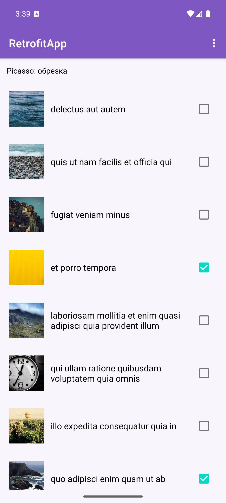
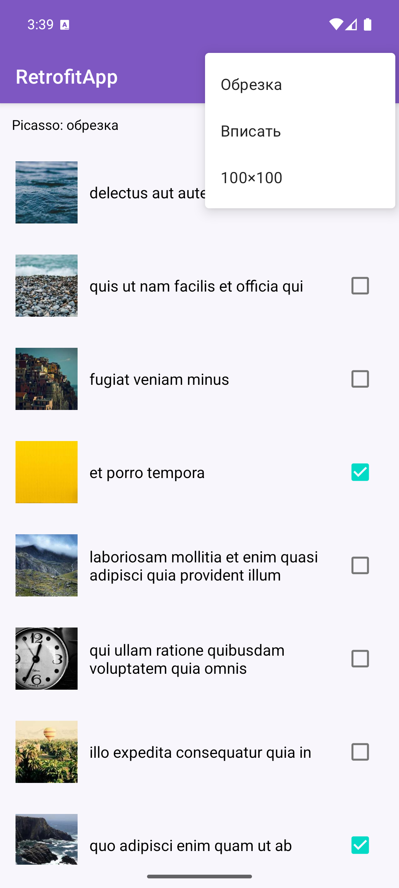
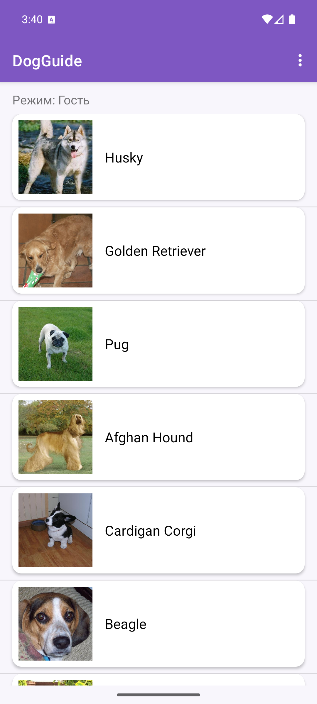
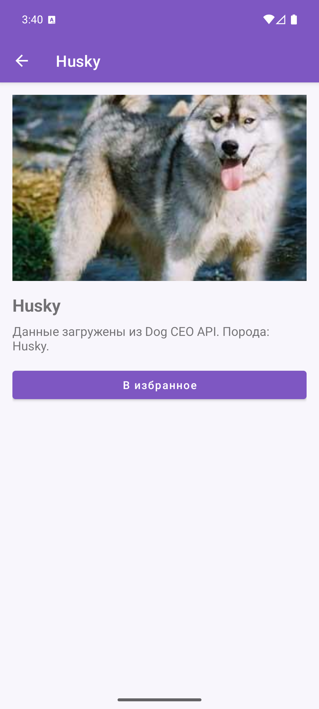
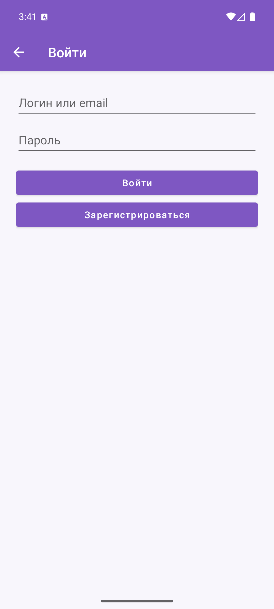

# Отчет по выполнению практической работы №5

### Автор: Фёдоров Антон Сергеевич
### Группа: БСБО-09-23

---

## Цель работы

Целью данной работы являлось освоение библиотеки Retrofit для HTTP-запросов к REST API, сериализации JSON через Gson, асинхронного вызова `Call.enqueue` и синхронного `Call.execute`, обработки ошибок сети и HTTP, а также загрузки изображений библиотекой Picasso с настройкой отображения.

---

## Структура проекта

Работа выполнена в каталоге `Lesson13`. `Lesson9`–`Lesson12` не изменялись. В Android Studio открывать **папку конкретного приложения**, не корень репозитория.

-   **`RetrofitApp`**: учебный модуль. Пакет `ru.mirea.fedorov.retrofitapp`. Список дел JSONPlaceholder, обновление через PUT, картинки Picasso.
-   **`DogGuide`**: контрольное приложение из ПЗ1. Пакет `ru.mirea.fedorov.dogguide`. Получение пород через Retrofit, фото через Picasso, обработка ошибок.
-   **`MovieProject`**: копия учебного каркаса из ПЗ4. Пакет `ru.mirea.fedorov.lesson9`.

---

## Выполненные задания

### Задание 1. RetrofitApp — список дел JSONPlaceholder

**Задача:** Создать модуль `RetrofitApp` (Empty Views Activity). Просматривать список дел и статус выполнения. API: `https://jsonplaceholder.typicode.com/`, сущность Todo.

Добавлены зависимости `retrofit:2.11.0`, `converter-gson:2.11.0` и разрешение `android.permission.INTERNET`.

POJO `Todo` описывает поля ответа: `userId`, `id`, `title`, `completed`. Интерфейс `ApiService` задаёт GET-запрос списка.

**Код для `Todo.java` (фрагмент):**

```java
public class Todo {
    @SerializedName("userId")
    @Expose
    private Integer userId;
    @SerializedName("id")
    @Expose
    private Integer id;
    @SerializedName("title")
    @Expose
    private String title;
    @SerializedName("completed")
    @Expose
    private Boolean completed;
    // getters/setters
}
```

**Код для `ApiService.java`:**

```java
public interface ApiService {
    @GET("todos")
    Call<List<Todo>> getTodos();

    @PUT("todos/{id}")
    Call<Todo> updateTodo(@Path("id") int id, @Body Todo todo);
}
```

В `MainActivity` собирается `Retrofit` с `baseUrl` и `GsonConverterFactory`. Запрос выполняется асинхронно через `enqueue`. Успешный ответ (`isSuccessful` и `body != null`) передаётся в `TodoAdapter` и `RecyclerView`. Ошибки HTTP и сети пишутся в Log и показываются Toast.

**Код для `MainActivity.java` (фрагмент):**

```java
public static final String BASE_URL = "https://jsonplaceholder.typicode.com/";

Retrofit retrofit = new Retrofit.Builder()
        .baseUrl(BASE_URL)
        .addConverterFactory(GsonConverterFactory.create())
        .build();
apiService = retrofit.create(ApiService.class);
Call<List<Todo>> call = apiService.getTodos();
call.enqueue(new Callback<List<Todo>>() {
    @Override
    public void onResponse(Call<List<Todo>> call, Response<List<Todo>> response) {
        if (response.isSuccessful() && response.body() != null) {
            todoAdapter = new TodoAdapter(MainActivity.this, response.body(), apiService);
            recyclerView.setAdapter(todoAdapter);
        } else {
            Log.e(TAG, "onResponse: " + response.code());
        }
    }
    @Override
    public void onFailure(Call<List<Todo>> call, Throwable t) {
        Toast.makeText(getApplicationContext(), t.getMessage(), Toast.LENGTH_LONG).show();
    }
});
```

Разметка элемента `item.xml`: заголовок `textViewTitle` и `checkBoxCompleted`.



---

### Задание 2. Обновление Todo при смене CheckBox

**Задача:** При изменении состояния CheckBox отправлять запрос на обновление Todo.

`ApiService.updateTodo` выполняет `PUT todos/{id}` с телом `Todo`. В `onBindViewHolder` слушатель CheckBox сначала снимается, затем выставляется `checked`, затем вешается заново — так повторное использование ViewHolder не шлёт лишний PUT. JSONPlaceholder принимает запрос и возвращает обновлённый объект (данные на сервере не сохраняются, это учебный API).

**Код для обработчика CheckBox:**

```java
holder.checkBoxCompleted.setOnCheckedChangeListener(null);
holder.checkBoxCompleted.setChecked(Boolean.TRUE.equals(todo.getCompleted()));
holder.checkBoxCompleted.setOnCheckedChangeListener((buttonView, isChecked) -> {
    todo.setCompleted(isChecked);
    apiService.updateTodo(todo.getId(), todo).enqueue(new Callback<Todo>() {
        @Override
        public void onResponse(Call<Todo> call, Response<Todo> response) {
            if (!response.isSuccessful()) {
                Log.e(TAG, "onResponse: " + response.code());
            }
        }
        @Override
        public void onFailure(Call<Todo> call, Throwable t) {
            Log.e(TAG, "onFailure: " + t.getMessage());
        }
    });
});
```


---

### Задание 3. Picasso — изображения и настройки отображения

**Задача:** Добавить изображение в разметку элемента, загрузить несколько картинок из интернета через Picasso, дать возможность настроить параметры отображения.

Зависимость `picasso:2.8`. У JSONPlaceholder у Todo нет URL картинки, поэтому для каждой задачи берётся стабильный адрес `https://picsum.photos/seed/todo{id}/200/200`. В адаптере: `placeholder`, `error`, режимы `centerCrop`, `centerInside` и `resize(100, 100)`. Режим выбирается пунктами меню «Обрезка», «Вписать», «100×100».

**Код для загрузки изображения:**

```java
RequestCreator request = Picasso.get()
        .load("https://picsum.photos/seed/todo" + id + "/200/200")
        .placeholder(R.drawable.placeholder)
        .error(R.drawable.error_image);
if (picassoMode == MODE_INSIDE) {
    request.fit().centerInside();
} else if (picassoMode == MODE_RESIZE) {
    request.resize(100, 100).centerCrop();
} else {
    request.fit().centerCrop();
}
request.into(imageView);
```




---

### Контрольное задание. DogGuide — Retrofit и Picasso

**Задача:** Открыть приложение из практики №1. Получать сущности из сети через Retrofit, обработать ошибки, показывать изображения через Picasso.

Слой `data` переведён с `HttpURLConnection` на Retrofit. Интерфейс `NetworkApi` для репозитория сохранён: `DogCeoApi` внутри вызывает `Call.execute()` на фоновом потоке (список пород грузится в `BreedListViewModel` на executor). Таймауты OkHttp — 8 секунд. Путь породы с подвидом (`retriever/golden`) передаётся как `@Path(encoded = true)`.

Ошибки: неуспешный HTTP, пустое тело, `status != success` — исключение и запись в Log. `BreedRepositoryImpl` при сбое сети переходит на `MockNetworkApi`, затем на локальную заглушку из двух пород.

В слое `app` Glide заменён на Picasso: список пород и карточка сущности, `placeholder` и `error`.

**Код для `DogCeoService.java`:**

```java
public interface DogCeoService {
    @GET("breeds/list/all")
    Call<BreedListResponse> getAllBreeds();

    @GET("breed/{path}/images/random")
    Call<ImageResponse> getRandomImage(@Path(value = "path", encoded = true) String path);
}
```

**Код для `DogCeoApi.java` (фрагмент):**

```java
Retrofit retrofit = new Retrofit.Builder()
        .baseUrl("https://dog.ceo/api/")
        .client(client)
        .addConverterFactory(GsonConverterFactory.create())
        .build();
this.service = retrofit.create(DogCeoService.class);

Response<BreedListResponse> response = service.getAllBreeds().execute();
if (!response.isSuccessful() || response.body() == null) {
    throw new IllegalStateException("Dog CEO HTTP " + response.code());
}
```

**Код для Picasso в списке пород:**

```java
Picasso.get()
        .load(breed.getImageUrl())
        .fit()
        .centerCrop()
        .placeholder(android.R.drawable.ic_menu_gallery)
        .error(android.R.drawable.ic_menu_report_image)
        .into(imageViewBreed);
```







---

## Выводы

В ходе выполнения работы были освоены следующие концепции:

-   Retrofit: интерфейс с аннотациями `@GET`, `@PUT`, `@Path`, `@Body`; `Retrofit.Builder` с `baseUrl` и `GsonConverterFactory`.
-   Асинхронный вызов `enqueue` с `Callback.onResponse` / `onFailure`; проверка `response.isSuccessful()`.
-   Синхронный `execute()` в слое data на фоновом потоке, чтобы не блокировать UI.
-   POJO и Gson: `@SerializedName` для полей JSON.
-   Обработка ошибок: код HTTP, пустое тело, отсутствие сети; в DogGuide — переход на заглушку.
-   Picasso: `load` / `into`, `placeholder`, `error`, `centerCrop`, `centerInside`, `resize`.
