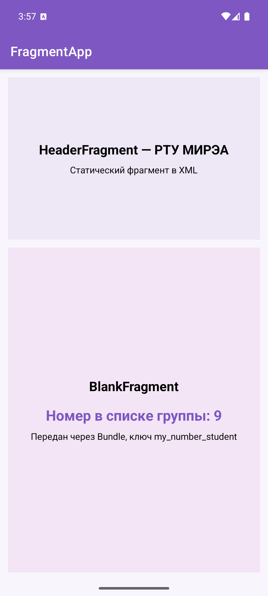
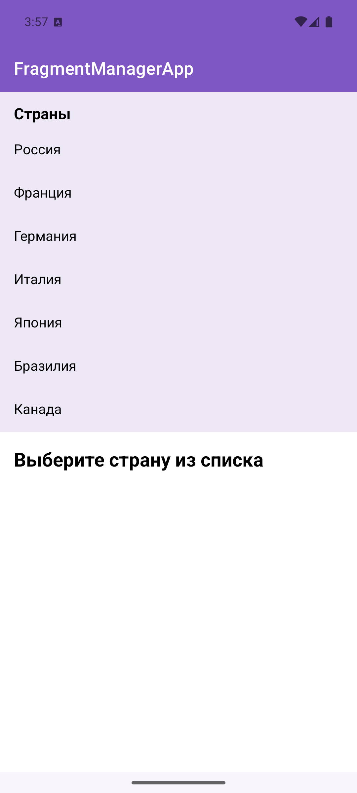
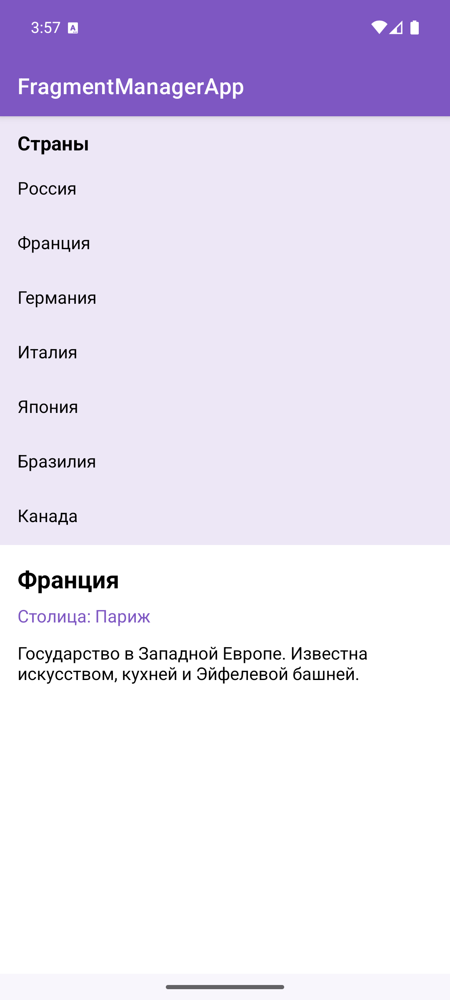
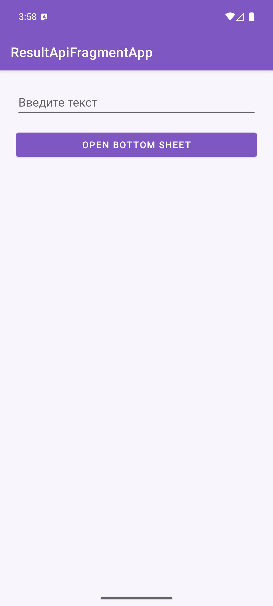
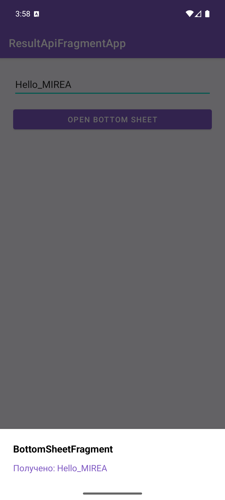
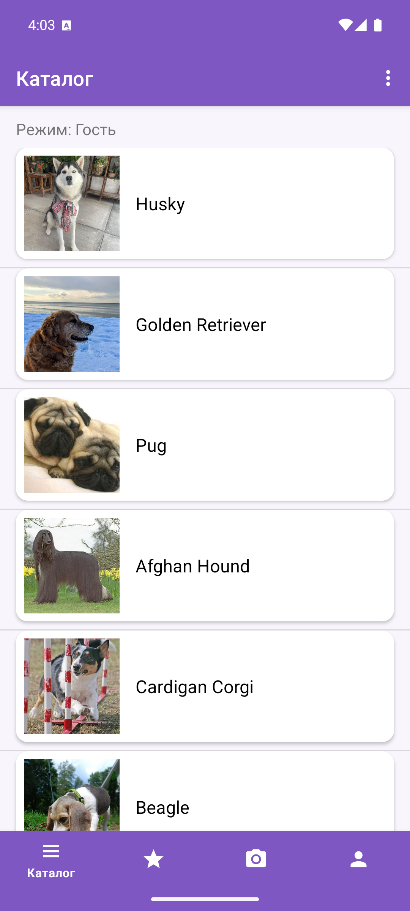
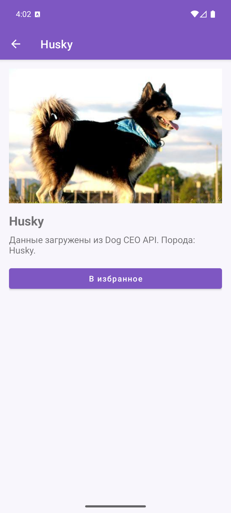
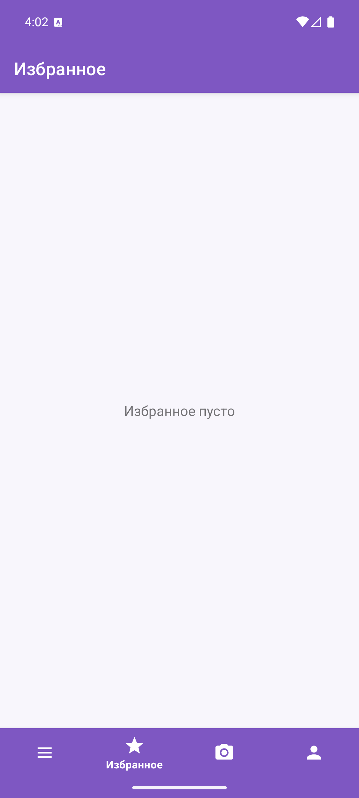
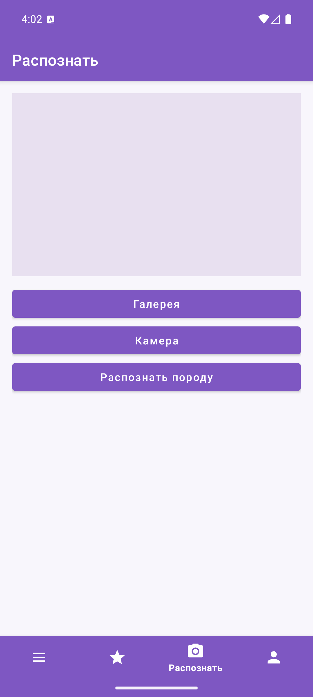
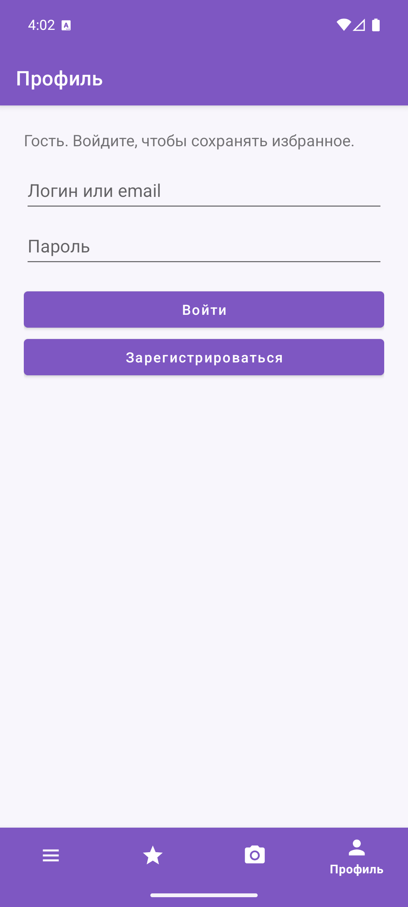

# Отчет по выполнению практической работы №6

### Автор: Фёдоров Антон Сергеевич
### Группа: БСБО-09-23

---

## Цель работы

Целью данной работы являлось освоение фрагментов AndroidX: статического и динамического добавления, `FragmentManager` и транзакций `add` / `replace` / `addToBackStack`, передачи данных через `Bundle`, общий `ViewModel`, Fragment Result API, интерфейс обратного вызова и навигации контрольного приложения через несколько фрагментов и `BottomNavigationView`.

---

## Структура проекта

Работа выполнена в каталоге `Lesson14`. `Lesson9`–`Lesson13` не изменялись. В Android Studio открывать **папку конкретного приложения**, не корень репозитория.

-   **`FragmentApp`**: учебный модуль. Пакет `ru.mirea.fedorov.fragmentapp`. Статический `HeaderFragment` и динамический `BlankFragment` с номером в списке группы.
-   **`FragmentManagerApp`**: учебный модуль. Пакет `ru.mirea.fedorov.fragmentmanagerapp`. Список стран и карточка выбранной страны, `ShareViewModel`, `replace` + `addToBackStack`.
-   **`ResultApiFragmentApp`**: учебный модуль. Пакет `ru.mirea.fedorov.resultapifragmentapp`. `DataFragment`, `BottomSheetDialogFragment`, Fragment Result API и интерфейс `FragmentListener`.
-   **`DogGuide`**: контрольное приложение из ПЗ1. Пакет `ru.mirea.fedorov.dogguide`. Каталог, избранное, распознавание и профиль на фрагментах, нижняя навигация, стек назад для карточки породы.

---

## Выполненные задания

### Задание 1. FragmentApp — статический и динамический фрагмент

**Задача:** Создать модуль `FragmentApp` (Empty Views Activity). Зависимость `androidx.fragment:fragment:1.8.5`. `BlankFragment` надувает `fragment_blank`. Динамическое добавление через `FragmentContainerView` без `android:name`. Номер студента передаётся в `Bundle` с ключом `my_number_student`.

В разметке `activity_main.xml` верхняя часть — статический тег `<fragment android:name="...HeaderFragment"/>`. Нижняя — `FragmentContainerView` без имени класса. `BlankFragment` добавляется только если `savedInstanceState == null`.

Номер в списке группы: **9**. Константа выводится на экран и пишется в Log.

**Код для `MainActivity.java` (фрагмент):**

```java
public static final String KEY_STUDENT_NUMBER = "my_number_student";
public static final int STUDENT_NUMBER = 9;

if (savedInstanceState == null) {
    Bundle bundle = new Bundle();
    bundle.putInt(KEY_STUDENT_NUMBER, STUDENT_NUMBER);
    getSupportFragmentManager().beginTransaction()
            .setReorderingAllowed(true)
            .add(R.id.fragment_container_view, BlankFragment.class, bundle)
            .commit();
}
```

**Код для `BlankFragment.java` (фрагмент):**

```java
@Override
public View onCreateView(
        @NonNull LayoutInflater inflater,
        @Nullable ViewGroup container,
        @Nullable Bundle savedInstanceState
) {
    return inflater.inflate(R.layout.fragment_blank, container, false);
}

@Override
public void onViewCreated(@NonNull View view, @Nullable Bundle savedInstanceState) {
    super.onViewCreated(view, savedInstanceState);
    int number = requireArguments().getInt(MainActivity.KEY_STUDENT_NUMBER);
    Log.d(TAG, MainActivity.KEY_STUDENT_NUMBER + " = " + number);
    TextView textView = view.findViewById(R.id.textViewStudentNumber);
    textView.setText(getString(R.string.student_number, number));
}
```



### Задание 2. FragmentManagerApp — список и детали

**Задача:** Несколько фрагментов: первый — список стран, второй — детали выбранного элемента. Транзакции `add`, `replace`, `addToBackStack`.

`MainActivity` при первом запуске добавляет `HeaderFragment` (список) и `DetailsFragment` (карточка) с тегами `header` и `details`. Клик по стране вызывает `replace` контейнера деталей и кладёт транзакцию в back stack.

**Код для `MainActivity.java` (фрагмент):**

```java
if (savedInstanceState == null) {
    getSupportFragmentManager().beginTransaction()
            .setReorderingAllowed(true)
            .add(R.id.fragment_header, HeaderFragment.class, null, "header")
            .add(R.id.fragment_details, DetailsFragment.class, null, "details")
            .commit();
}
```

**Код для клика в `HeaderFragment`:**

```java
viewModel.selectItem(country);
getParentFragmentManager().beginTransaction()
        .setReorderingAllowed(true)
        .replace(R.id.fragment_details, DetailsFragment.class, null, "details")
        .addToBackStack("details")
        .commit();
```





### Задание 3. Передача данных: ShareViewModel, Result API, интерфейс

Список и карточка в `FragmentManagerApp` связаны через `ShareViewModel`, общий для activity:

```java
public class ShareViewModel extends ViewModel {
    private final MutableLiveData<Country> selectedItem = new MutableLiveData<>();

    public void selectItem(Country item) {
        selectedItem.setValue(item);
    }

    public LiveData<Country> getSelectedItem() {
        return selectedItem;
    }
}
```

`DetailsFragment` подписан на `getViewLifecycleOwner()` и показывает название, столицу и описание.

Модуль `ResultApiFragmentApp`: `DataFragment` с `EditText` (`editTextInfo`) и кнопкой `OPEN BOTTOM SHEET`. Текст уходит в `setFragmentResult("requestKey", bundle)` с ключом `"key"`, затем показывается `BottomSheetFragment` через `getChildFragmentManager()`. Слушатель регистрируется в `onCreate` нижней шторки — результат хранится, пока листener не подключится.

Дополнительно `MainActivity` реализует `FragmentListener.sendResult`: `DataFragment` в `onAttach` приводит контекст к интерфейсу и дублирует текст в Toast.

**Код для `DataFragment` (фрагмент):**

```java
String text = editTextInfo.getText().toString();
Bundle result = new Bundle();
result.putString(BUNDLE_KEY, text);
getChildFragmentManager().setFragmentResult(REQUEST_KEY, result);
if (listener != null) {
    listener.sendResult(text);
}
BottomSheetFragment bottomSheet = new BottomSheetFragment();
bottomSheet.show(getChildFragmentManager(), "ModalBottomSheet");
```





### Задание 4. Контрольное приложение DogGuide

Список пород, избранное, распознавание и профиль переведены на фрагменты. `MainActivity` — хост: `FragmentContainerView` и `BottomNavigationView` (Каталог, Избранное, Распознать, Профиль). Вкладки переключаются через `hide` / `show` без back stack. Карточка породы добавляется поверх текущей вкладки с `addToBackStack`; нижняя навигация скрывается, появляется стрелка «назад».

`ProfileFragment` показывает форму входа и регистрации для гостя и логин с кнопкой «Выйти» для пользователя. ViewModel по-прежнему единственный мост presentation → domain. `BreedListViewModel` и `RecognizeViewModel` живут на уровне activity, чтобы сессия и выбранное фото не терялись при смене вкладки.

**Код для переключения вкладки и карточки:**

```java
fm.beginTransaction()
        .setReorderingAllowed(true)
        .hide(catalogFragment)
        .hide(favoritesFragment)
        .hide(recognizeFragment)
        .hide(profileFragment)
        .show(target)
        .commit();

getSupportFragmentManager().beginTransaction()
        .setReorderingAllowed(true)
        .hide(tab)
        .add(R.id.fragment_container, BreedDetailsFragment.newInstance(breedId), TAG_DETAILS)
        .addToBackStack(TAG_DETAILS)
        .commit();
```











---

## Выводы

В ходе выполнения работы были освоены следующие концепции:

-   Статический фрагмент в XML через тег `<fragment android:name=...>` и динамический через `FragmentContainerView` без `android:name`.
-   `FragmentManager.beginTransaction()`, `setReorderingAllowed(true)`, `add` / `replace` / `hide` / `show`, `commit`, охрана `savedInstanceState == null`.
-   Передача аргументов: `Bundle` и `requireArguments()`, общий `ViewModel` с `ViewModelProvider(requireActivity())`, Fragment Result API (`requestKey` / `key`), интерфейс на Activity.
-   `BottomSheetDialogFragment` и показ через `getChildFragmentManager()`.
-   Навигация контрольного приложения: вкладки без стека, карточка сущности со стеком назад, `BottomNavigationView`, профиль из данных авторизации.
-   Жизненный цикл view фрагмента: наблюдение LiveData через `getViewLifecycleOwner()`.
