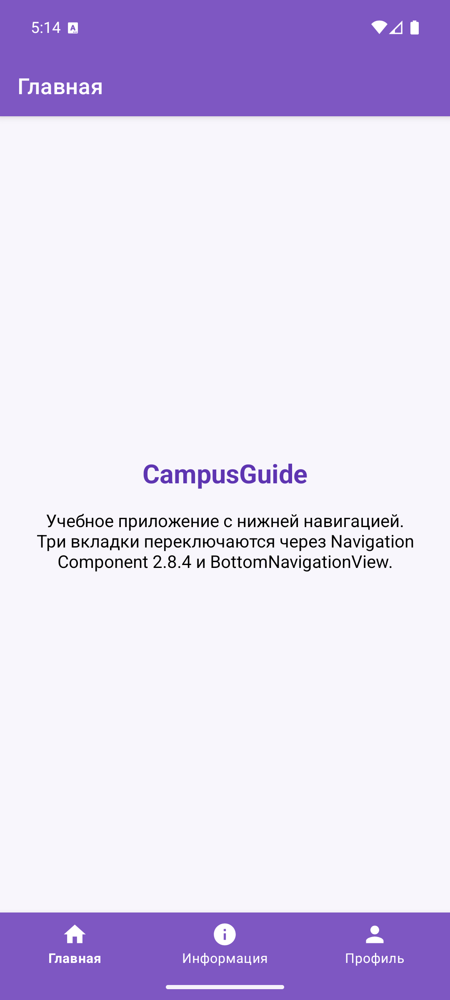
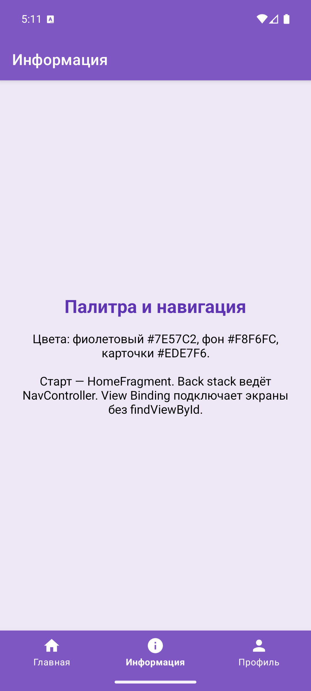
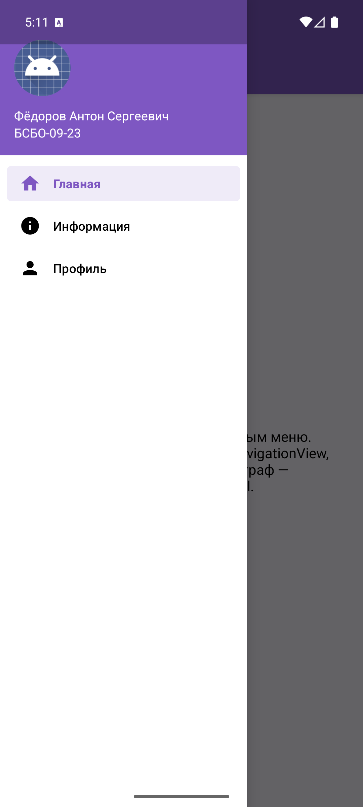
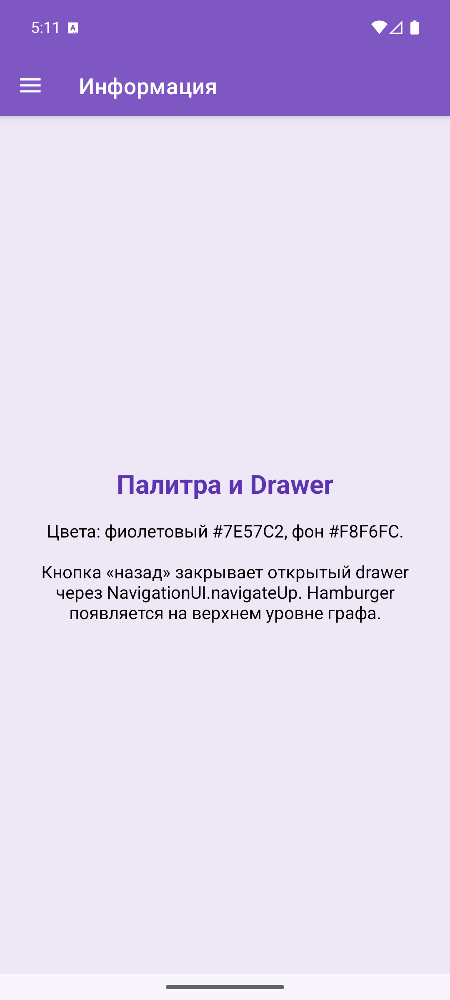
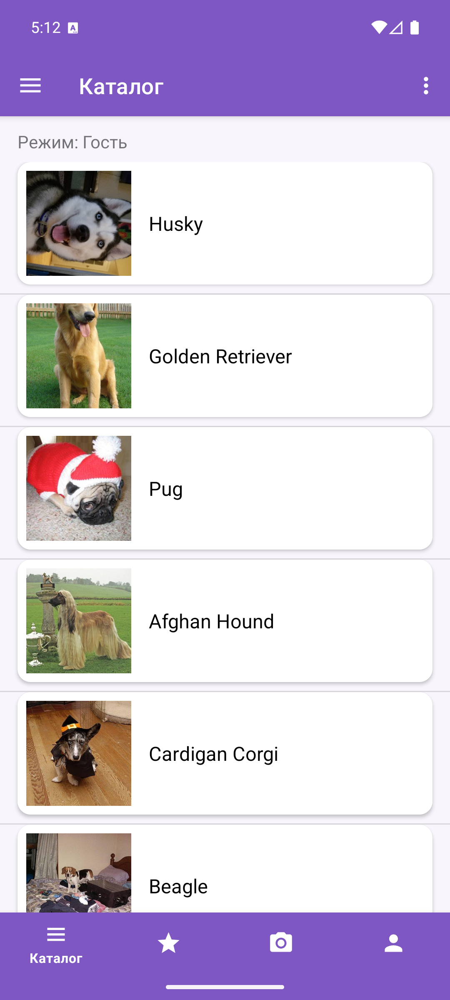
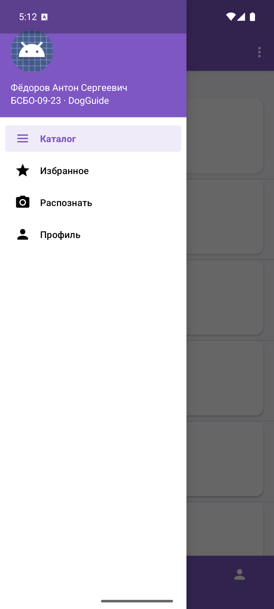
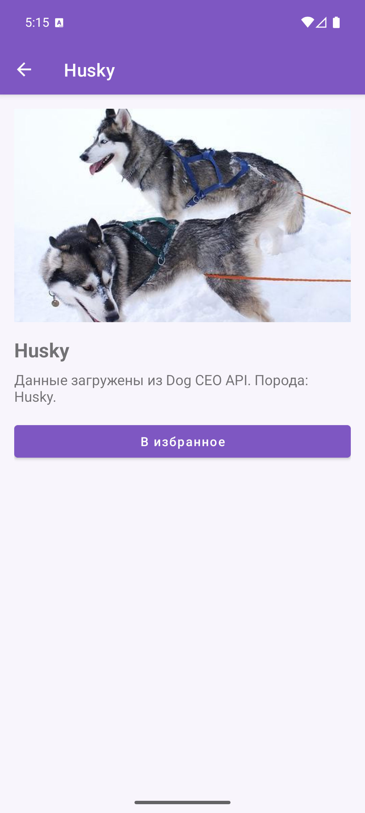
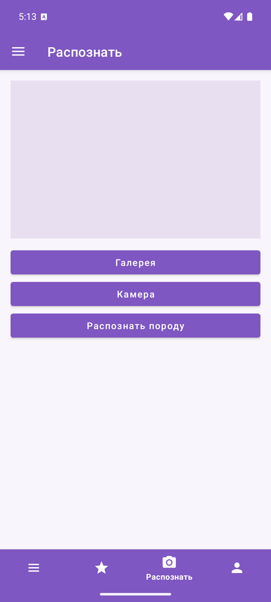

# Отчет по выполнению практической работы №7

### Автор: Фёдоров Антон Сергеевич
### Группа: БСБО-09-23

---

## Цель работы

Целью данной работы являлось освоение View Binding, Navigation Component 2.8.4 (`NavHostFragment`, `NavGraph`, `NavController`, `AppBarConfiguration`, `NavigationUI`), нижней навигации `BottomNavigationView` и бокового меню `Navigation Drawer`.

---

## Структура проекта

Работа выполнена в каталоге `Lesson15`. `Lesson9`–`Lesson14` не изменялись. В Android Studio открывать **папку конкретного приложения**, не корень репозитория.

-   **`BottomNavigationApp`**: учебный модуль. Пакет `ru.mirea.fedorov.bottomnavigationapp`. Три вкладки Home / Info / Profile, View Binding, граф `navigation.xml`.
-   **`NavigationDrawerApp`**: учебный модуль. Пакет `ru.mirea.fedorov.navigationdrawerapp`. Тот же набор экранов через `DrawerLayout` + `NavigationView`, граф `mobile_navigation.xml`.
-   **`DogGuide`**: контрольное приложение из ПЗ1. Пакет `ru.mirea.fedorov.dogguide`. Каталог, избранное, распознавание и профиль на Navigation Component; нижняя навигация и drawer на одном графе; карточка породы — destination с аргументом `breed_id`.

---

## Выполненные задания

### Задание 1. BottomNavigationApp — нижняя навигация

**Задача:** Модуль `BottomNavigationApp` (Empty Views Activity). Концепция приложения, иконки, цветовая палитра, `BottomNavigationView` + Navigation Component, View Binding.

Концепция **CampusGuide**: три вкладки студента РТУ МИРЭА. Палитра как в предыдущих работах: `#7E57C2`, фон `#F8F6FC`, карточки `#EDE7F6`. Идентификаторы пунктов меню совпадают с destination графа: `navigation_home`, `navigation_info`, `navigation_profile`.

В `app/build.gradle` включён View Binding и зависимости Navigation Component 2.8.4.

**Код для `MainActivity.java` (фрагмент):**

```java
binding = ActivityMainBinding.inflate(getLayoutInflater());
setContentView(binding.getRoot());

AppBarConfiguration appBarConfiguration = new AppBarConfiguration.Builder(
        R.id.navigation_home,
        R.id.navigation_info,
        R.id.navigation_profile
).build();
NavHostFragment navHostFragment = (NavHostFragment) getSupportFragmentManager()
        .findFragmentById(R.id.nav_host_fragment);
NavController navController = navHostFragment.getNavController();
NavigationUI.setupActionBarWithNavController(this, navController, appBarConfiguration);
NavigationUI.setupWithNavController(binding.navView, navController);
```

**Код для `HomeFragment.java` (фрагмент):**

```java
binding = FragmentHomeBinding.inflate(inflater, container, false);
return binding.getRoot();

@Override
public void onDestroyView() {
    super.onDestroyView();
    binding = null;
}
```






### Задание 2. NavigationDrawerApp — боковое меню

**Задача:** Модуль `NavigationDrawerApp`. Концепция, палитра, `Navigation Drawer`, закрытие меню кнопкой «назад».

Концепция **DrawerGuide**: те же три экрана, хост — `NavHostFragment`, граф — `mobile_navigation.xml`. Разметка как в учебнике: `activity_main.xml` (`DrawerLayout`), `app_bar_main.xml` (Coordinator + Toolbar), `content_main.xml` (NavHost), `nav_header_main.xml` (ФИО и группа).

`AppBarConfiguration.setOpenableLayout(drawer)` даёт hamburger на верхнем уровне. `NavigationUI.navigateUp` закрывает открытый drawer. Системная кнопка «назад» тоже закрывает меню, затем отдаёт событие `NavController`.

**Код для `MainActivity.java` (фрагмент):**

```java
appBarConfiguration = new AppBarConfiguration.Builder(
        R.id.nav_home,
        R.id.nav_info,
        R.id.nav_profile
).setOpenableLayout(binding.drawerLayout).build();
navController = navHostFragment.getNavController();
NavigationUI.setupActionBarWithNavController(this, navController, appBarConfiguration);
NavigationUI.setupWithNavController(binding.navView, navController);

@Override
public boolean onSupportNavigateUp() {
    return NavigationUI.navigateUp(navController, appBarConfiguration)
            || super.onSupportNavigateUp();
}
```







### Задание 3. Контрольное приложение DogGuide

Требование ТЗ: открыть приложение из практической работы №1 и реализовать навигацию через Navigation Component и Navigation Drawer / Bottom Navigation.

Исходник скопирован из `Lesson14/DogGuide`, `Lesson14` не менялся. Включён View Binding. Граф `nav_graph.xml`: `nav_catalog`, `nav_favorites`, `nav_recognize`, `nav_profile` и `nav_breed_details` с аргументом `breed_id`. Глобальный action `action_open_breed_details` открывает карточку из каталога и избранного.

Нижняя навигация и drawer подключены к одному `NavController`. Верхний уровень `AppBarConfiguration` — четыре вкладки, поэтому на карточке породы появляется стрелка «назад», нижняя панель скрывается, drawer блокируется.

**Код для настройки графа и скрытия нижней панели:**

```java
appBarConfiguration = new AppBarConfiguration.Builder(
        R.id.nav_catalog,
        R.id.nav_favorites,
        R.id.nav_recognize,
        R.id.nav_profile
).setOpenableLayout(binding.drawerLayout).build();
NavigationUI.setupActionBarWithNavController(this, navController, appBarConfiguration);
NavigationUI.setupWithNavController(binding.bottomNavigation, navController);
NavigationUI.setupWithNavController(binding.navView, navController);

navController.addOnDestinationChangedListener((controller, destination, arguments) -> {
    boolean details = destination.getId() == R.id.nav_breed_details;
    binding.bottomNavigation.setVisibility(details ? View.GONE : View.VISIBLE);
    binding.drawerLayout.setDrawerLockMode(
            details
                    ? DrawerLayout.LOCK_MODE_LOCKED_CLOSED
                    : DrawerLayout.LOCK_MODE_UNLOCKED
    );
});
```

**Код перехода к карточке породы:**

```java
@Override
public void openBreedDetails(String breedId) {
    Bundle args = new Bundle();
    args.putString(BreedDetailsFragment.ARG_BREED_ID, breedId);
    navController.navigate(R.id.action_open_breed_details, args);
}
```

Фрагменты надувают разметку через `*Binding.inflate`, `binding = null` в `onDestroyView`. ViewModel по-прежнему единственный мост presentation → domain. Раскладка списка каталога задаётся из `MainActivity` через activity-scoped `BreedListViewModel`.











---

## Выводы

В ходе выполнения работы были освоены следующие концепции:

-   View Binding: `buildFeatures { viewBinding true }`, `ActivityMainBinding.inflate`, `FragmentXxxBinding.inflate`, обнуление `binding` в `onDestroyView`.
-   Navigation Component 2.8.4: `NavHostFragment`, XML-граф, `NavController.navigate`, аргументы destination, `app:defaultNavHost="true"`.
-   `AppBarConfiguration` задаёт верхний уровень графа: hamburger на вкладках, Up на карточке породы.
-   `NavigationUI.setupWithNavController` связывает `BottomNavigationView` и `NavigationView` с одним графом; идентификаторы меню совпадают с id destination.
-   `NavigationUI.navigateUp` закрывает открытый drawer; системная «назад» сначала закрывает меню, затем pop back stack.
-   Контрольное приложение: hide/show вкладок заменены графом; карточка породы — destination с `breed_id`; нижняя панель скрывается слушателем destination.
