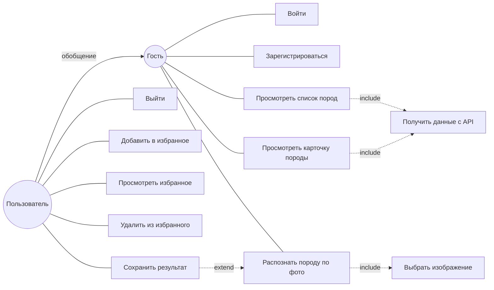
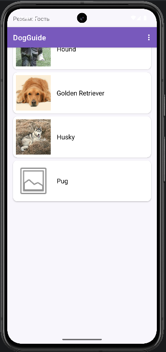
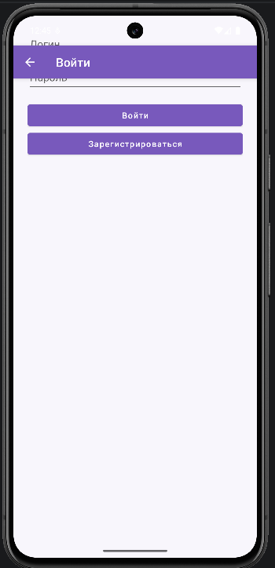

# Отчет по выполнению практической работы №1

### Автор: Фёдоров Антон Сергеевич
### Группа: БСБО-09-23

---

## Цель работы

Целью данной работы являлось освоение принципов структурирования исходного кода мобильного приложения, изучение чистой архитектуры (Clean Architecture) и правила зависимости (Dependency Rule), проектирование приложения с помощью диаграммы вариантов использования, разделение кода на слои `presentation` / `domain` / `data`, реализация учебного каркаса с SharedPreferences и контрольного приложения со своим функционалом.

---

## Структура проекта

Работа выполнена в каталоге `Lesson9` и состоит из двух Android-проектов и материалов проектирования:

-   **`MovieProject`**: учебный каркас из методички. Пакет `ru.mirea.fedorov.lesson9`. Экран «любимый фильм», слои domain/data/presentation, сохранение через SharedPreferences.
-   **`DogGuide`**: контрольное приложение — справочник пород собак. Пакет `ru.mirea.fedorov.dogguide`. Авторизация, внешний JSON API, локальная БД, список и карточка сущности, различия гостя и пользователя, распознавание породы моделью TensorFlow Lite.
-   **`design`**: диаграмма вариантов использования (`dogguide-usecase.drawio`) и карта экранов со зонами ответственности.

Правило зависимостей во всех модулях:

```
Presentation  →  Domain  ←  Data
```

Слой `domain` не зависит от Android, Retrofit, Room, SharedPreferences и TensorFlow Lite. Контракт репозитория объявлен в domain, реализация — в data.

---

## Выполненные задания

### Задание 1. Диаграмма вариантов использования (проект `DogGuide`)

**Задача:** Спроектировать собственное приложение и нарисовать UML use-case диаграмму. В приложении обязательны авторизация, внешний JSON-сервис, сохранение в БД, список сущностей с изображениями, страница сущности, разные возможности у гостя и авторизованного пользователя, использование обученной модели TensorFlow Lite.

Выбрана тема **справочник пород собак**. Внешний сервис — [Dog CEO API](https://dog.ceo/dog-api/) (без ключа). Акторы: гость и пользователь (обобщение гостя).

Диаграмма в draw.io: [`design/dogguide-usecase.drawio`](design/dogguide-usecase.drawio).



---

### Задание 2. Разделение на слои

**Задача:** На основе use case спроектировать экраны приложения с указанием зоны ответственности (`presentation` / `domain` / `data`).

Карта экранов: [`design/dogguide-screens.md`](design/dogguide-screens.md).

| Экран | presentation | domain | data |
|--------|----------------|--------|------|
| Вход | `LoginActivity` | `LoginUserUseCase`, `RegisterUserUseCase` | `UserRepositoryImpl`, Room |
| Список пород | `MainActivity`, `BreedAdapter` | `GetBreedListUseCase` | `BreedRepositoryImpl`, Dog CEO |
| Карточка породы | `BreedDetailsActivity` | `GetBreedDetailsUseCase`, избранное | `BreedRepositoryImpl`, `FavoriteRepositoryImpl` |
| Избранное | `FavoritesActivity` | `GetFavoriteBreedsUseCase` | Room, фильтр по логину |
| Распознавание | `RecognizeActivity` | `RecognizeBreedUseCase` | TensorFlow Lite, MobileNet v1 |

Сборка зависимостей выполняется в `DogGuideApp` (ручной DI): экраны получают репозитории из `Application` и создают use case.

---

### Задание 3. Учебный каркас MovieProject

**Задача:** Создать проект `Empty Views Activity` с пакетом `ru.mirea.fedorov.lesson9`, модуль `MovieProject`. Реализовать экран «любимый фильм»: TextView, EditText, кнопки сохранения и отображения. Разнести код по слоям domain и data.

Структура пакетов:

```
presentation/MainActivity
domain/models/Movie
domain/repository/MovieRepository
domain/usecases/GetFavoriteFilmUseCase
domain/usecases/SaveMovieToFavoriteUseCase
data/storage/MovieStorage
data/repository/MovieRepositoryImpl
```

**Код для `Movie.java`:**

```java
package ru.mirea.fedorov.lesson9.domain.models;

public class Movie {
    private int id;
    private String name;

    public Movie(int id, String name) {
        this.id = id;
        this.name = name;
    }

    public int getId() {
        return id;
    }

    public String getName() {
        return name;
    }
}
```

**Код для `MovieRepository.java` (контракт в domain):**

```java
package ru.mirea.fedorov.lesson9.domain.repository;

import ru.mirea.fedorov.lesson9.domain.models.Movie;

public interface MovieRepository {
    boolean saveMovie(Movie movie);

    Movie getMovie();
}
```

**Код для `SaveMovieToFavoriteUseCase.java`:**

```java
package ru.mirea.fedorov.lesson9.domain.usecases;

import ru.mirea.fedorov.lesson9.domain.models.Movie;
import ru.mirea.fedorov.lesson9.domain.repository.MovieRepository;

public class SaveMovieToFavoriteUseCase {
    private MovieRepository movieRepository;

    public SaveMovieToFavoriteUseCase(MovieRepository movieRepository) {
        this.movieRepository = movieRepository;
    }

    public boolean execute(Movie movie) {
        if (movie.getName() == null || movie.getName().trim().isEmpty()) {
            return false;
        }
        return movieRepository.saveMovie(movie);
    }
}
```

**Разметка экрана `activity_main.xml`:**

```xml
<?xml version="1.0" encoding="utf-8"?>
<androidx.constraintlayout.widget.ConstraintLayout xmlns:android="http://schemas.android.com/apk/res/android"
    xmlns:app="http://schemas.android.com/apk/res-auto"
    xmlns:tools="http://schemas.android.com/tools"
    android:id="@+id/main"
    android:layout_width="match_parent"
    android:layout_height="match_parent"
    android:background="@color/background"
    android:padding="24dp"
    tools:context=".presentation.MainActivity">

    <TextView
        android:id="@+id/textViewMovie"
        android:layout_width="0dp"
        android:layout_height="wrap_content"
        android:gravity="center"
        android:text="@string/no_data"
        android:textColor="@color/black"
        android:textSize="16sp"
        app:layout_constraintBottom_toTopOf="@id/buttonGetMovie"
        app:layout_constraintEnd_toEndOf="parent"
        app:layout_constraintStart_toStartOf="parent"
        app:layout_constraintTop_toTopOf="parent"
        app:layout_constraintVertical_chainStyle="packed" />

    <com.google.android.material.button.MaterialButton
        android:id="@+id/buttonGetMovie"
        android:layout_width="wrap_content"
        android:layout_height="wrap_content"
        android:layout_marginTop="24dp"
        android:backgroundTint="@color/purple_button"
        android:text="@string/show_favorite_movie"
        android:textAllCaps="false"
        app:cornerRadius="24dp"
        app:layout_constraintBottom_toTopOf="@id/editTextMovie"
        app:layout_constraintEnd_toEndOf="parent"
        app:layout_constraintStart_toStartOf="parent"
        app:layout_constraintTop_toBottomOf="@id/textViewMovie" />

    <EditText
        android:id="@+id/editTextMovie"
        android:layout_width="220dp"
        android:layout_height="wrap_content"
        android:layout_marginTop="32dp"
        android:gravity="center"
        android:hint="@string/fill_me"
        android:inputType="text"
        android:minHeight="48dp"
        app:layout_constraintBottom_toTopOf="@id/buttonSaveMovie"
        app:layout_constraintEnd_toEndOf="parent"
        app:layout_constraintStart_toStartOf="parent"
        app:layout_constraintTop_toBottomOf="@id/buttonGetMovie" />

    <com.google.android.material.button.MaterialButton
        android:id="@+id/buttonSaveMovie"
        android:layout_width="wrap_content"
        android:layout_height="wrap_content"
        android:layout_marginTop="16dp"
        android:backgroundTint="@color/purple_button"
        android:text="@string/save_favorite_movie"
        android:textAllCaps="false"
        app:cornerRadius="24dp"
        app:layout_constraintBottom_toBottomOf="parent"
        app:layout_constraintEnd_toEndOf="parent"
        app:layout_constraintStart_toStartOf="parent"
        app:layout_constraintTop_toBottomOf="@id/editTextMovie" />

</androidx.constraintlayout.widget.ConstraintLayout>
```

---

### Задание 4. SharedPreferences без Context в domain

**Задача:** Добавить сохранение и чтение любимого фильма через SharedPreferences. Context не должен попадать в слой domain.

Context используется только в `MovieStorage` (data). Use case принимает интерфейс `MovieRepository`.

**Код для `MovieStorage.java`:**

```java
package ru.mirea.fedorov.lesson9.data.storage;

import android.content.Context;
import android.content.SharedPreferences;

public class MovieStorage {
    private static final String PREFS_NAME = "favorite_movie";
    private static final String KEY_ID = "movie_id";
    private static final String KEY_NAME = "movie_name";

    private final SharedPreferences prefs;

    public MovieStorage(Context context) {
        this.prefs = context.getApplicationContext()
                .getSharedPreferences(PREFS_NAME, Context.MODE_PRIVATE);
    }

    public void save(int id, String name) {
        prefs.edit()
                .putInt(KEY_ID, id)
                .putString(KEY_NAME, name)
                .apply();
    }

    public int getId() {
        return prefs.getInt(KEY_ID, -1);
    }

    public String getName() {
        return prefs.getString(KEY_NAME, "");
    }
}
```

**Код для `MovieRepositoryImpl.java`:**

```java
package ru.mirea.fedorov.lesson9.data.repository;

import android.content.Context;

import ru.mirea.fedorov.lesson9.data.storage.MovieStorage;
import ru.mirea.fedorov.lesson9.domain.models.Movie;
import ru.mirea.fedorov.lesson9.domain.repository.MovieRepository;

public class MovieRepositoryImpl implements MovieRepository {
    private final MovieStorage storage;

    public MovieRepositoryImpl(Context context) {
        this.storage = new MovieStorage(context);
    }

    @Override
    public boolean saveMovie(Movie movie) {
        storage.save(movie.getId(), movie.getName());
        return true;
    }

    @Override
    public Movie getMovie() {
        String name = storage.getName();
        if (name == null || name.isEmpty()) {
            return new Movie(-1, "Нет данных!");
        }
        return new Movie(storage.getId(), name);
    }
}
```

**Связывание слоёв в `MainActivity.java`:**

```java
MovieRepository movieRepository = new MovieRepositoryImpl(this);

findViewById(R.id.buttonSaveMovie).setOnClickListener(new View.OnClickListener() {
    @Override
    public void onClick(View view) {
        Boolean result = new SaveMovieToFavoriteUseCase(movieRepository)
                .execute(new Movie(2, text.getText().toString()));
        textView.setText(String.format("Save result %s", result));
    }
});

findViewById(R.id.buttonGetMovie).setOnClickListener(new View.OnClickListener() {
    @Override
    public void onClick(View view) {
        Movie movie = new GetFavoriteFilmUseCase(movieRepository).execute();
        textView.setText(movie.getName());
    }
});
```

Пустое имя фильма не сохраняется (`Save result false`). После перезапуска приложения сохранённое имя читается из SharedPreferences.

---

### Задание 5. Контрольное приложение DogGuide

**Задача:** Создать проект `ru.mirea.fedorov.dogguide` как болванку для наращивания функционала: use case на слоях domain и data, репозитории сначала с тестовыми данными, затем полный функционал из диаграммы.

#### 5.1. Сборка зависимостей

**Код для `DogGuideApp.java`:**

```java
package ru.mirea.fedorov.dogguide;

import android.app.Application;

import androidx.room.Room;

import ru.mirea.fedorov.dogguide.data.repository.BreedRepositoryImpl;
import ru.mirea.fedorov.dogguide.data.repository.FavoriteRepositoryImpl;
import ru.mirea.fedorov.dogguide.data.repository.RecognitionRepositoryImpl;
import ru.mirea.fedorov.dogguide.data.repository.UserRepositoryImpl;
import ru.mirea.fedorov.dogguide.data.storage.AppDatabase;
import ru.mirea.fedorov.dogguide.data.storage.PasswordHasher;

public class DogGuideApp extends Application {
    private UserRepository userRepository;
    private BreedRepository breedRepository;
    private FavoriteRepository favoriteRepository;
    private RecognitionRepository recognitionRepository;

    @Override
    public void onCreate() {
        super.onCreate();
        AppDatabase database = Room.databaseBuilder(this, AppDatabase.class, "dogguide.db")
                .fallbackToDestructiveMigration()
                .allowMainThreadQueries()
                .build();

        userRepository = new UserRepositoryImpl(database.userDao(), new PasswordHasher());
        breedRepository = new BreedRepositoryImpl();
        favoriteRepository = new FavoriteRepositoryImpl(database.favoriteDao());
        recognitionRepository = new RecognitionRepositoryImpl(this);
    }
    // геттеры репозиториев
}
```

#### 5.2. Авторизация

Пользователи хранятся в Room. Пароль не пишется открытым текстом (SHA-256). Сессия живёт только в памяти: после закрытия приложения пользователь снова гость, но аккаунт сохраняется.

**Код для `UserRepositoryImpl.java` (фрагмент):**

```java
@Override
public User login(String login, String password) {
    String normalized = normalize(login);
    UserEntity stored = userDao.getByLogin(normalized);
    if (stored == null) {
        return null;
    }
    if (!stored.getPasswordHash().equals(passwordHasher.hash(password))) {
        return null;
    }
    currentUser = new User(normalized, normalized);
    return currentUser;
}

@Override
public User register(String login, String password) {
    String normalized = normalize(login);
    if (userDao.getByLogin(normalized) != null) {
        return null;
    }
    userDao.insert(new UserEntity(normalized, passwordHasher.hash(password)));
    currentUser = new User(normalized, normalized);
    return currentUser;
}
```

Гость видит каталог и может распознавать породу. Избранное доступно только после входа. Неверный пароль и повторная регистрация того же логина отклоняются.

#### 5.3. Внешний JSON API

`BreedRepositoryImpl` запрашивает `https://dog.ceo/api/breeds/list/all` и случайные фото пород. Domain об этом не знает. Запрос выполняется в фоне, на время загрузки показывается ProgressBar. При ошибке сети — небольшой офлайн-набор.

#### 5.4. База данных избранного

Избранное хранится в Room. Составной ключ: логин владельца + id породы, поэтому у разных аккаунтов разные списки.

**Код для `FavoriteDao.java`:**

```java
@Dao
public interface FavoriteDao {
    @Query("SELECT * FROM favorites WHERE ownerLogin = :ownerLogin")
    List<FavoriteBreedEntity> getAll(String ownerLogin);

    @Insert(onConflict = OnConflictStrategy.IGNORE)
    long insert(FavoriteBreedEntity entity);

    @Query("DELETE FROM favorites WHERE ownerLogin = :ownerLogin AND id = :id")
    int deleteById(String ownerLogin, String id);

    @Query("SELECT COUNT(*) FROM favorites WHERE ownerLogin = :ownerLogin AND id = :id")
    int countById(String ownerLogin, String id);
}
```

#### 5.5. Распознавание породы (TensorFlow Lite)

Использована готовая модель **MobileNet v1 224** (ImageNet, файл `app/src/main/assets/mobilenet_v1.tflite`). Классификатор живёт в data (`TfliteBreedClassifier`). Метки ImageNet маппятся на идентификаторы Dog CEO (`Siberian husky` → `husky`). На экране показываются топ-3 класса модели. Источник изображения: галерея или камера.

---

## Скриншоты






---

## Выводы

В ходе выполнения работы были освоены следующие ключевые концепции Android-разработки:

-   Чистая архитектура и правило зависимости: внутренние слои не зависят от UI, БД и фреймворков.
-   Проектирование сценариев использования (UML use case: association, include, extend, generalization).
-   Разделение приложения на `presentation`, `domain` и `data`.
-   Паттерн Repository: интерфейс в domain, реализация в data.
-   Use case (`execute`) как точка входа бизнес-логики.
-   SharedPreferences для локального хранения без протекания `Context` в domain.
-   Работа с внешним JSON API (Dog CEO) и отображение списка с изображениями.
-   Локальная БД Room, привязка данных к пользователю.
-   Авторизация: регистрация, проверка пароля, различия гостя и пользователя.
-   Подключение обученной модели TensorFlow Lite и обработка изображения с камеры/галереи.
-   Ручная инверсия зависимостей через класс `Application`.
